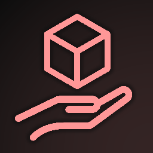

# Hi there! Thank you for checking out PickMoreBlocks!

PickMoreBlocks is a client-side [Fabric](https://fabricmc.net) mod that attempts to fix what I believe to be small gaps in the vanilla middle mouse click functionality, making the creative and survival experience _that little bit smoother_!

Read on to find out how to download this mod, and what opportunities doing so will provide you with!

## Getting Started
Due to the use of `BlockPickInteractionAware` and `EntityPickInteractionAware` interfaces to make this mod compact, you will need to download [Fabric API](https://github.com/FabricMC/fabric) in order to use it. Once you have, simply place both the Fabric API and PickMoreBlocks in your mods folder.

There is no configuration menu at this stage, since I don't deem the features of this mod to be obvious nor plentiful enough for you to want to disable them. However, if you play on a server, consider contacting your server admin to make sure they don't consider this mod to be a cheat.

## Feature List
### TNT & Gravity-Affected Blocks
In vanilla, gravity-affected blocks like sand can only be pickblocked when they are stationary, in block form. PickMoreBlocks fixes this to work with fallingBlock entities too!

For the sake of inclusion, TNT has also been fixed in the same way. I'd imagine this is only really useful for technical players who work with TNT, a group far larger than 0 these days!
### Fire & Portals
The most fleshed-out feature in this mod so far, fire and portals can give you flint and steel when middle-mouse clicked. The reason why this is so complicated is because flint and steel is not the only way to start a fire in Minecraft, so if the game cannot find flint and steel in your inventory but it _can_ find a fire charge, it will give that to you instead!

If you have neither flint and steel nor a fire charge in your creative mode inventory, you will be given a fully repaired flint and steel.

  

    <h4>For the nerds who want to know how the code for this works, click here!</h4>
  

  <blockquote>

    @Mixin(Block.class)
    public abstract class BlockMixin implements BlockPickInteractionAware {

        @Override
        public ItemStack getPickedStack(BlockState state, BlockView view, BlockPos pos, PlayerEntity player, HitResult result) {
            if (state.getBlock() instanceof AbstractFireBlock || state.getBlock() instanceof NetherPortalBlock) {
            
if the block is fire or a nether portal...
                
                for (int i = 0; i < player.getInventory().size(); i++) {
                    ItemStack getStackAtSlot = player.getInventory().getStack(i);
                    
iteratively check every slot in the player's inventory
                    
                    if (getStackAtSlot.isOf(Items.FLINT_AND_STEEL) || getStackAtSlot.isOf(Items.FIRE_CHARGE)) {
                        return getStackAtSlot;
                        
if the slot contains flint and steel or (at a lower priority) a fire charge, swap it with the mainhand slot...
                        
                    }
                }
                return new ItemStack(Items.FLINT_AND_STEEL);
                
or if neither can be found, give the player a new flint and steel (creative mode)
                
            }
            return state.getBlock().getPickStack(player.getEntityWorld(), pos, state);
            
if the block is neither fire nor a nether portal, attempt vanilla pickblock functionality
            
        }

    }
  </blockquote>

